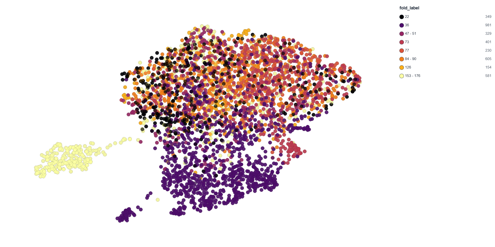

# Protein Transformer

A small protein language model trained from scratch, with attention pattern
analysis to study how structural information emerges across model scale and
training dynamics.

**Status:** 5M model trained (validation perplexity 14.36),
with embeddings that recover SCOP fold structure well above chance
(k-NN lift ≈ 0.48 over a hypergeometric baseline). Training 20M model next.

---

## What this project is

This project trains an encoder-only transformer on protein sequences using
masked language modeling (MLM), then analyzes what the model learned by
examining its attention patterns. The central research question: *at what
scale and at what point in training does structural information emerge in
attention heads?*

---

## Results so far

**5M model** (6 layers, d_model 256, 8 heads, 4.87M params), trained on
~80K homology-split SwissProt proteins via MLM:

| Metric | Value | Baseline |
|--------|-------|----------|
| Validation perplexity | 14.36 | ~20 (uniform over 20 AAs) |
| Fold k-NN hit rate (min_fold_size=2) | 0.593 | 0.111 (random) |
| Fold k-NN hit rate (min_fold_size=10) | 0.630 | 0.137 (random) |

The model is trained only on raw sequences with no structural labels, yet its
mean-pooled embeddings cluster proteins by SCOP fold far above chance. The
signal strengthens on denser folds, confirming it is genuine fold-level
structure rather than a small-fold artifact. The k-NN evaluation uses the
TAPE remote homology dataset (1,195 SCOP folds) as an external probe.



A UMAP projection of the embeddings (illustration only — the k-NN number is the
quantitative evidence) shows one fold group cleanly isolating while most folds
overlap, consistent with the model's scale.

---

## Project structure
protein-transformer/
├── configs/
│   ├── 1M.yaml
│   └── 5M.yaml
├── src/plm/
│   ├── config.py
│   ├── data/
│   │   ├── tokenizer.py
│   │   ├── fasta.py
│   │   ├── dataset.py
│   │   └── collator.py
│   ├── model/
│   │   ├── embeddings.py
│   │   ├── attention.py
│   │   ├── transformer.py
│   │   └── mlm.py
│   ├── training/
│   │   ├── trainer.py
│   │   └── checkpoint.py
│   └── eval/
│       ├── perplexity.py
│       ├── knn_probe.py        # fold k-NN probe + hypergeometric baseline
│       └── tape_data.py        # TAPE LMDB loader
└── scripts/
    ├── build_filtered_fasta.py
    ├── build_splits.py
    ├── train.py
    ├── evaluate.py
    └── export_for_protspace.py  # embeddings + labels for ProtSpace viz

---

## Quickstart

### 1. Clone and install

```bash
git clone https://github.com/dariasof/protein-transformer.git
cd protein-transformer
python -m venv .venv
source .venv/Scripts/activate   # Windows Git Bash
# source .venv/bin/activate     # macOS / Linux
python -m pip install --upgrade pip
python -m pip install -e ".[dev]"
```

### 2. Build homology-aware splits

**Step 1 — local.** Filter SwissProt to 100K clean sequences and write
`data/processed/filtered.fasta`:

```bash
python scripts/build_filtered_fasta.py --config configs/5M.yaml
```

**Step 2 — Kaggle (requires MMseqs2).** Cluster at 30% identity, assign
whole clusters to splits, tokenize, and save:

```bash
# install MMseqs2 on Kaggle
!apt-get install -y mmseqs2

python scripts/build_splits.py --config configs/5M.yaml
```

Produces `data/processed/train.pt` (80,435), `val.pt` (9,613),
`test.pt` (9,952).

### 3. Train

```bash
python scripts/train.py --config configs/5M.yaml
```

### 4. Evaluate

Perplexity only:

```bash
python scripts/evaluate.py \
    --config configs/5M.yaml \
    --checkpoint data/checkpoints/resume.pt
```

Perplexity plus fold k-NN probe (requires the TAPE remote homology LMDB):

```bash
python scripts/evaluate.py \
    --config configs/5M.yaml \
    --checkpoint data/checkpoints/resume.pt \
    --tape-path data/remote_homology/remote_homology_train.lmdb
```

---

## Trained models

5M checkpoints (steps 500–17560) are on the HuggingFace Hub at
[`dariasof/protein-transformer-5M`](https://huggingface.co/dariasof/protein-transformer-5M).
The full checkpoint sequence is retained for the Week 10 training-dynamics
study.

---

## Design decisions

**Tokenization.** Character-level, one token per amino acid. Vocabulary of 24
tokens: 20 standard amino acids + `[PAD]`, `[UNK]`, `[CLS]`, `[MASK]`.
`[PAD]` is id 0 so PyTorch's default padding behavior works without
configuration.

**MLM objective.** 15% of amino acid positions selected per sequence.
Of those, 80% replaced with `[MASK]`, 10% replaced with a random amino acid,
10% left unchanged. The 80/10/10 split prevents the model from only building
good representations at `[MASK]` positions — it must represent all tokens
well, which is what makes the embeddings useful for downstream tasks.

**Homology-aware splits.** Sequences clustered with MMseqs2 at 30% identity.
Whole clusters assigned to train/val/test — no sequence has a close homolog
in a different split. This is the methodological detail that makes held-out
evaluation meaningful.

**Data filtering.** Sequences between 30 and 511 residues, standard amino
acids only (no B/J/O/U/X/Z). Keeps sequences clean for the 24-token vocab
and avoids polluting training with ambiguous residues.

**Architecture.** Encoder-only transformer, pre-norm convention (LayerNorm
before each sub-layer, not after). Bidirectional attention — no causal mask —
because MLM prediction benefits from full sequence context in both directions.
The 1M baseline is 4 layers / 4 heads / d_model 128; the 5M model is
6 layers / 8 heads / d_model 256.

**Embedding extraction.** Mean pooling over residue hidden states (taken after
the final LayerNorm, before the MLM head), not the `[CLS]` token. The model
has no CLS-specific training objective, so mean pooling is the principled
choice for sequence-level embeddings.

**Fold k-NN probe.** Embeddings are scored by whether a protein's nearest
neighbors share its SCOP fold. The metric is hit rate (≥1 of the top-10
neighbors shares the fold), reported against a per-query hypergeometric
baseline; lift is hit rate minus baseline. Queries whose fold has too few
members to be findable are filtered via `min_fold_size`.

**Mixed precision.** fp16 via `torch.autocast` + `GradScaler`. Gradients
unscaled before clipping to preserve the `max_grad_norm` threshold.
bf16 unsupported on Kaggle P100/T4 — fp16 only.

**Checkpointing.** Two checkpoint types: a rolling `resume.pt` saved every
500 steps (overwrites each time), and permanent named checkpoints every
`retain_every` steps (`ckpt_step_XXXXXX.pt`). The named checkpoints are the
raw material for the training-dynamics emergence study in Week 10 — they
cannot be retrofitted later. Checkpoints are mirrored to the HuggingFace Hub.

---

## Roadmap

| Week | Focus | Status |
|------|-------|--------|
| 1 | Data pipeline: tokenizer, dataset, MLM collator | ✅ Done |
| 2 | Transformer architecture + training loop | ✅ Done |
| 3 | Config system, 100K proteins, homology-aware splits, eval script | ✅ Done |
| 4 | Train 5M model, fold k-NN embedding check | ✅ Done |
| 5 | Train 20M model, apply for cluster access | — |
| 6–8 | Attention analysis pipeline, head atlas | — |
| 9–11 | Scaling study, training dynamics, ESM-2 comparison | — |
| 12–14 | Polish, writeup, HuggingFace model cards | — |

---

## License

MIT — see [LICENSE](LICENSE).