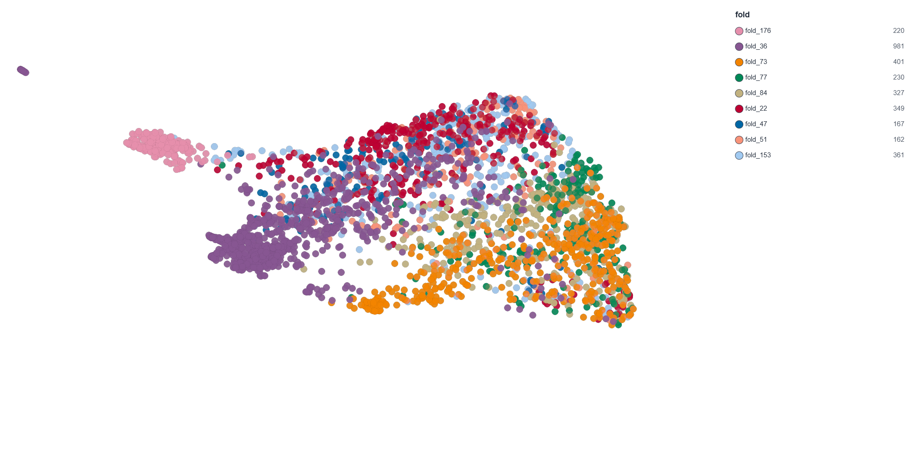
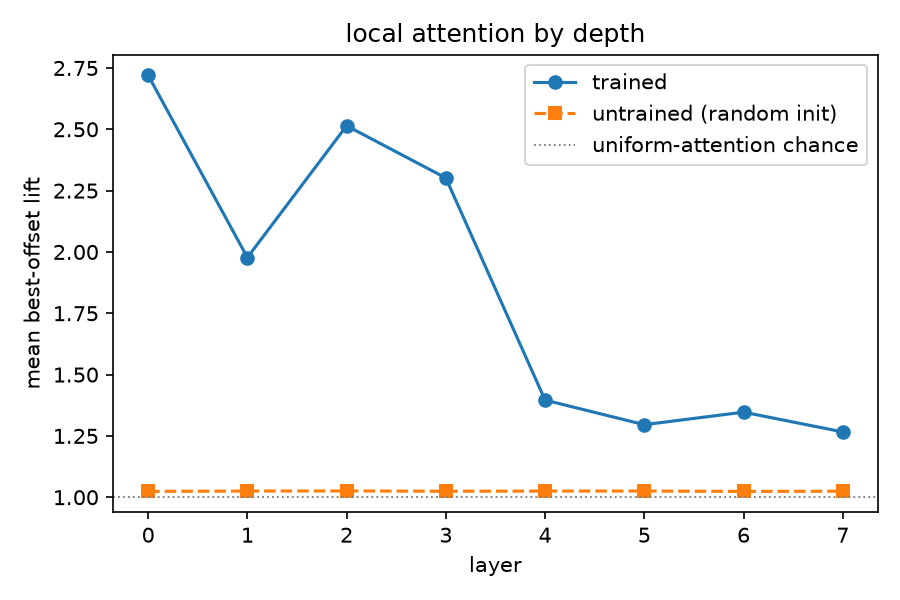
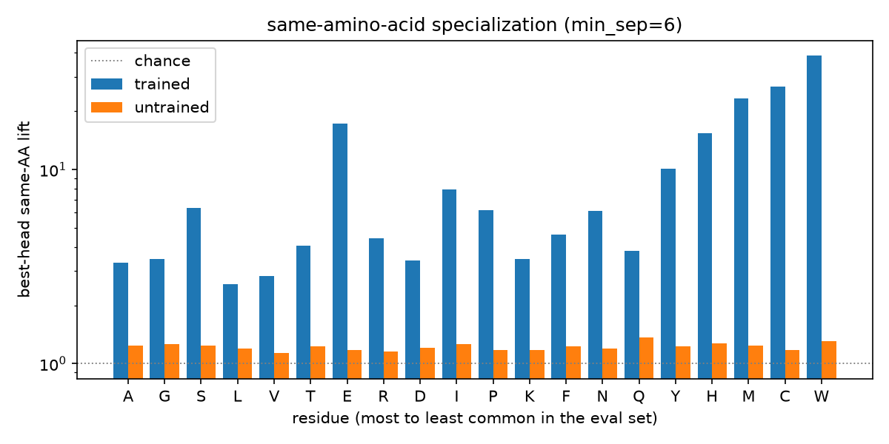
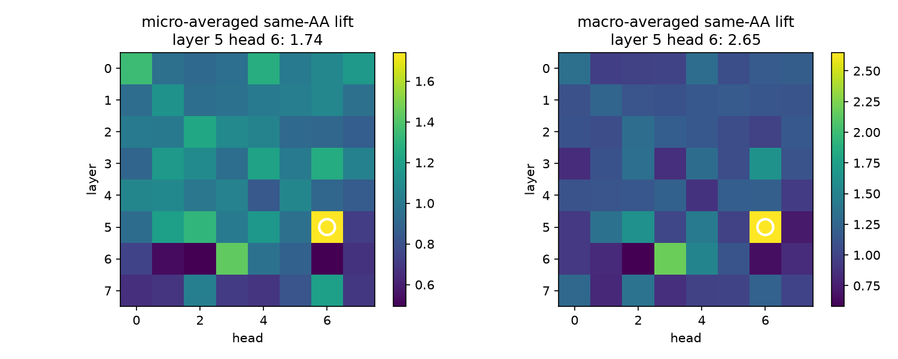
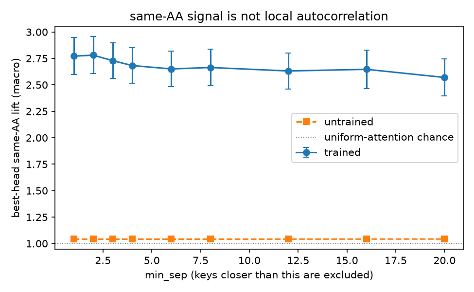

# Protein Transformer

A small protein language model trained from scratch, with attention pattern
analysis to study what structural information emerges in attention heads
across model scale.

**Status:** Complete at the 20M scale. Three models trained (0.86M, 4.87M,
19.6M parameters) on a fixed 80K-sequence corpus. MLM perplexity is saturated
across the range. Attention heads specialize on sequence position and amino
acid identity, both far above an untrained baseline, but show no long-range
contact recovery above chance at any scale — while ESM-2, with *fewer*
parameters and far more pretraining data, shows a strong signal on the
identical pipeline. Fold-level information in embeddings does improve with
scale. The analysis pipeline is built, tested, and validated against that
positive control.

---

## What this project is

An encoder-only transformer trained on protein sequences with masked language
modeling (MLM), followed by a mechanistic analysis of what the model learned
from its attention patterns. The original question was *at what scale does
structural information emerge in attention heads?* The answer, within this
range, is that it does not — and the more informative result is characterizing
what does emerge instead.

---

## Headline finding

Three models spanning 0.86M–19.6M parameters were trained on the same 80K
homology-split SwissProt corpus and evaluated identically.

**MLM perplexity is saturated below 1M parameters.** The 0.86M and 4.87M
models reach the same validation perplexity to two decimal places despite a
5.6× difference in capacity. Only the 19.6M model moves it at all, by 0.18.

**Attention heads do learn — position and residue identity.** Heads
concentrate attention at fixed sequence offsets (best head 3.80× chance,
p = 1.7e-16) and on residues sharing the query's amino acid type (best head
2.65× chance macro-averaged, p = 2.4e-16). An untrained model with identical
architecture scores 1.03 and 1.05 on the same measures. Both effects are
robust to excluding nearby positions, so neither is an artifact of local
attention.

**Long-range contact structure never appears in attention.** Per-head
`precision@L/5` on a 90-protein contact set sits at the random baseline for
all three models. The best head of the 19.6M model reaches p = 0.052
uncorrected — not significant even before adjusting for 64 heads tested.

**Fold-level structure does improve with scale.** k-NN fold-recovery lift
rises from 0.482 to 0.551 across the same range. The models learn
sequence-level fold identity while pairwise contact information stays absent.

**ESM-2 8M, run through the identical pipeline, recovers contacts strongly**
(best head lift 0.16, p < 0.0001). It has *fewer* parameters than the 19.6M
model here and orders of magnitude more pretraining data. Since capacity is
demonstrably not the binding constraint within this range, the gap points to
training data volume rather than model size. This has not been tested
directly — see [Limitations](#limitations).

Taken together: **these models learn sequence position and residue identity as
non-local properties of the input, but nothing above that level appears in
attention at any scale up to 20M parameters on 80K sequences.**

---

## Results

| | 1M | 5M | 20M |
|---|---|---|---|
| Layers / heads / d_model | 4 / 4 / 128 | 6 / 8 / 256 | 8 / 8 / 448 |
| Parameters | 863,256 | 4,870,000 | 19,552,536 |
| Training steps | 12,570 | 17,570 | 25,140 |
| Validation perplexity | 14.36 | 14.36 | 14.18 |
| Fold k-NN hit rate | 0.619 | 0.630 | 0.688 |
| Fold k-NN lift over baseline | 0.482 | 0.493 | 0.551 |
| Mean contact precision@L/5 | 0.0199 | 0.0189 | 0.0197 |
| Contact lift over baseline | 0.0015 | 0.0005 | 0.0013 |

Baselines: uniform over 20 amino acids gives perplexity ~20; the k-NN
hypergeometric baseline is 0.137 at `min_fold_size=10`; the contact baseline
is 0.0184, the mean fraction of eligible long-range pairs that are true
contacts across the evaluation set.

Perplexity is flat between 1M and 5M, so MLM performance saturates below 1M
parameters on this corpus — capacity is not the binding constraint across most
of the range. Fold-level structure improves monotonically, most of the gain
arriving at 20M. Contact recovery is indistinguishable from chance at every
scale and does not trend in either direction. MLM loss is therefore a poor
proxy for what structural information a model has organized, and fold identity
and pairwise contact information are dissociable.




UMAP projections of mean-pooled embeddings for the nine largest SCOP folds,
5M (top) and 20M (bottom), with a fixed random seed so the two layouts are
comparable. fold_176 separates cleanly in both. At 20M, fold_36 forms a
compact cluster and fold_22/fold_47 occupy a distinct region; at 5M the same
folds are dispersed through the central mass. This is illustration only — the
k-NN lift (0.493 → 0.551) is the quantitative evidence.

### Known confound between the 5M and 20M runs

The 20M run used a learning rate of 2.0e-4 and batch size 32; the 5M run used
3.0e-4 and batch size 64. The reduction follows common practice for larger
models at smaller batch sizes, but it means parameter count is not the only
variable separating the two runs. Any claim about the effect of scale is
really a claim about scale plus tuned learning rate.

Because batch sizes differ, cross-model comparisons use tokens seen or
normalized training progress on the x-axis, never raw step count. The retained
checkpoint sequences allow comparison at matched token budgets rather than
only at the endpoints, which is a partial control on this confound.

---

## What attention heads do learn

Two label-free per-head scores, run on the 20M model and on an untrained model
of identical architecture. Both are maxima over 64 heads, so the untrained
baseline is not decoration — it measures the selection bias inherent in taking
a maximum, and a trained number is only meaningful as a distance from it.

### Local-offset attention

For each head, the mean attention mass on each sequence-offset diagonal,
expressed as lift over the uniform-attention expectation of `1/L`.



| layer | 0 | 1 | 2 | 3 | 4 | 5 | 6 | 7 |
|---|---|---|---|---|---|---|---|---|
| trained | 2.72 | 1.98 | 2.51 | 2.30 | 1.40 | 1.30 | 1.35 | 1.27 |
| untrained | 1.03 | 1.02 | 1.03 | 1.03 | 1.03 | 1.03 | 1.03 | 1.02 |

Best head is layer 0 head 3 at 3.80× chance (Wilcoxon vs lift 1.0,
p = 1.7e-16, n = 90 proteins). 33 of 64 heads exceed 1.5. The structure is
confined to layers 0–3; layers 4–7 top out at 1.55.

The untrained model returns 1.02–1.03 uniformly, close to the theoretical 1.0
for uniform attention. The small excess is the selection bias from taking a
maximum over 16 offsets.

Note that in ESM-2, contact-sensitive heads concentrate in layers 4–5 of 6 —
the back half. In this model the back half is where local structure
disappears.

### Same-amino-acid attention

For each head, the share of eligible attention mass landing on residues that
share the query's amino acid type, divided by the share expected from that
protein's composition. Chance is computed per query rather than assumed,
because it varies with composition and enormously between residue types
(Leu ~10% of residues, Trp ~1%).



| residue | W | C | M | H | Y | A | L |
|---|---|---|---|---|---|---|---|
| best-head lift | 38.6 | 26.9 | 23.4 | 15.4 | 10.1 | 3.3 | 2.6 |
| untrained | 1.20 | 1.20 | 1.32 | 1.37 | 1.36 | 1.24 | 1.26 |

The ordering tracks residue rarity almost monotonically, which is expected:
the ceiling on lift is `1 / (chance rate)`, so a rare residue admits far
higher values than a common one. Lifts are not comparable in magnitude across
residues, only against their own baselines.

**Layer 5 head 6 is a rare-residue specialist**, reaching 38.6× on tryptophan
and 26.9× on cysteine. Its micro-averaged score is only 1.77 — averaging over
query positions weights by residue frequency, which dilutes a rare-residue
head into near-invisibility. Macro-averaging across residue types surfaces it
at 2.65.



Vig et al. (2021) report amino-acid-type heads in *early* layers of the TAPE
transformer. Here the specialist sits at layer 5 of 8, in the back half.

### The signal is not local autocorrelation

Protein sequences have real short-range compositional structure — hydrophobic
patches, low-complexity runs, coiled-coil repeats. A head that only attends at
a fixed nearby offset therefore scores above chance on same-AA with no residue
preference at all. Given that this model demonstrably has strong local heads,
this confound has to be excluded rather than assumed away.



| min_sep | 1 | 2 | 4 | 6 | 8 | 12 | 16 | 20 |
|---|---|---|---|---|---|---|---|---|
| best-head lift | 2.77 | 2.78 | 2.68 | 2.65 | 2.66 | 2.63 | 2.65 | 2.57 |

Excluding every key within 20 residues of the query moves the lift by about
7%. The same-AA signal reflects residue identity, not proximity.

### Cysteine attention is not disulfide detection

Cysteine pairing is a tertiary contact, so a 26.9× cysteine head is worth
ruling out as a contact signal in disguise. Restricting `precision@L/5`
scoring to eligible Cys–Cys pairs only (|i−j| ≥ 24, both resolved; 109 pairs
across 14 proteins, 21.1% of them true contacts against 1.56% for all eligible
pairs), layer 5 head 6 reaches AUROC 0.551 — chance. The head detects the
residue type, not which cysteine pairs with which. The dissociation holds.

The sample is thin: enough to rule out a strong effect, not a weak one.

---

## Attention does not recover long-range contacts, unlike ESM-2

Every (layer, head) of the 20M model was scored against the 90-protein contact
evaluation set with `precision@L/5` (long-range pairs, |i−j| ≥ 24),
symmetrized and APC-corrected.

| | 20M (this model) | ESM-2 (`esm2_t6_8M_UR50D`) |
|---|---|---|
| Parameters | 19,552,536 | 7,840,842 |
| Layers × heads | 8 × 8 = 64 | 6 × 20 = 120 |
| Mean precision across all heads | 0.0197 | 0.0367 |
| Mean random baseline | 0.0184 | 0.0184 |
| Best single head, lift | 0.0087 | 0.1597 |
| Best head, Wilcoxon p (paired, n=90) | 0.052 (uncorrected) | < 0.0001 |

The 20M model's best head does not clear significance even before correcting
for having tested 64 heads (Bonferroni would require p < 0.05/64 ≈ 0.0008).
Mean lift across all heads is 0.0012 — indistinguishable from zero.

ESM-2, run through the identical eval set, geometry, and scoring code, shows a
clear and highly significant signal concentrated in layer 5 (6 of the top 10
heads), consistent with the mid-network localization of structure-sensitive
heads reported in Vig et al. (2021). This was run specifically as a positive
control: a null result on an unvalidated pipeline is uninformative, and this
rules out a scoring or geometry bug as the explanation.

Note that ESM-2 8M is the *smaller* model in this comparison. Fewer
parameters, more pretraining data, better contact recovery — which is what
points the interpretation toward data volume.

---

## Contact evaluation set

Built from the TAPE/ProteinNet validation split. The filter chain, with counts:

| Stage | Remaining |
|---|---|
| ProteinNet validation split | 224 |
| Length 80–300 and coverage ≥ 90% | 98 |
| `n_contacts >= k` where `k = L // 5` | 90 |

Median per-protein random baseline across the kept set is **0.015** — the
fraction of eligible pairs that are true long-range contacts. This is the
number any per-head precision must be read against.

**Why the validation split rather than test.** The test split holds only 40
records, too few to survive contamination filtering against the training
sequences. No training happens on any of this data — the model is frozen and
its attention probed — so TAPE's train/valid/test boundary, which exists to
protect supervised contact predictors from leakage, does not apply here. The
leakage that does matter is between these sequences and the 100K SwissProt
training set, which is handled separately by MMseqs2.

**Why `n_contacts >= k`.** Precision@k always selects exactly `k` pairs, so a
protein with fewer than `k` true contacts has a ceiling of `n_contacts / k`
rather than 1.0. Averaging across proteins with different ceilings makes the
mean uninterpretable. The 8 proteins removed by this filter were all short
(L 88–108), the same small-L effect that motivated the length floor.

**Contact convention.** ProteinNet supplies Cα coordinates only, so contacts
are Cα–Cα within 8 Å. The contact-prediction literature (CASP, ESM) uses
Cβ–Cβ with Cα substituted for glycine. The two agree on most pairs but differ
near the threshold, where side-chain orientation matters, so absolute
precision figures here are not directly comparable to published Cβ-based
numbers.

---

## Limitations

**The data-volume interpretation is inference, not experiment.** ESM-2 differs
from these models on parameter count *and* pretraining data simultaneously.
The saturation of perplexity below 1M parameters argues capacity is not
binding, but the controlled test — training 5M on 300–500K sequences with
architecture, learning rate, and batch size held fixed — has not been run.

**Eval proteins were not filtered against each other.** The 90 proteins were
filtered against the training set but never for mutual redundancy, so the
effective sample size for per-protein statistics may be below 90.


**Secondary structure was not scored.** SS sits between local patterns and
tertiary contacts in complexity, and is the obvious untested intermediate rung
between the same-AA result and the contact null.

**Cα-only contacts** (see contact convention above) and the **5M/20M
learning-rate confound** (see above) both apply throughout.

---

## Project structure

```
protein-transformer/
├── configs/
│   ├── 1M.yaml
│   ├── 5M.yaml
│   └── 20M.yaml
├── src/plm/
│   ├── __init__.py
│   ├── config.py
│   ├── analysis/
│   │   ├── contacts.py         # contact maps + eligibility masks
│   │   ├── extract.py          # per-head attention matrices (in-house + ESM-2)
│   │   ├── contact_score.py    # symmetrize, APC, precision@L/5
│   │   ├── offset_score.py     # per-head local-offset lift
│   │   ├── label_score.py      # shared same-label conditional lift
│   │   ├── aa_score.py         # same-amino-acid lift
│   │   └── load.py             # rebuild a trained model from a Hub checkpoint
│   ├── data/
│   │   ├── __init__.py
│   │   ├── tokenizer.py
│   │   ├── fasta.py
│   │   ├── dataset.py
│   │   └── collator.py
│   ├── eval/
│   │   ├── __init__.py
│   │   ├── perplexity.py
│   │   ├── knn_probe.py        # fold k-NN probe + hypergeometric baseline
│   │   └── tape_data.py        # TAPE LMDB loader
│   ├── model/
│   │   ├── __init__.py
│   │   ├── embeddings.py
│   │   ├── attention.py
│   │   ├── transformer.py
│   │   └── mlm.py
│   └── training/
│       ├── __init__.py
│       ├── trainer.py
│       └── checkpoint.py
├── scripts/
│   ├── inspect_data.py
│   ├── build_dataset.py
│   ├── build_filtered_fasta.py
│   ├── build_splits.py
│   ├── build_eval_set.py             # contact eval set from ProteinNet
│   ├── train.py
│   ├── evaluate.py
│   ├── run_head_scoring.py           # contact scoring, all (layer, head)
│   ├── run_behavioural_scoring.py    # offset + same-AA scoring
│   ├── make_behavioural_figures.py   # figures from the scoring output
│   ├── esm2_comparison.py            # positive-control run against ESM-2
│   ├── export_for_protspace.py       # embeddings + labels for ProtSpace viz
│   └── filter_protspace.py
└── tests/
    ├── __init__.py
    ├── test_tokenizer.py
    ├── test_collator.py
    ├── test_model_shapes.py
    ├── test_checkpoint_resume.py
    ├── test_contacts.py
    └── test_contact_score.py
```

---

## Quickstart

### 1. Clone and install

```bash
git clone https://github.com/dariasof/protein-transformer.git
cd protein-transformer
python -m venv .venv
source .venv/Scripts/activate   # Windows Git Bash
# source .venv/bin/activate     # macOS / Linux
python -m pip install --upgrade pip
python -m pip install -e ".[dev]"
```

### 2. Build homology-aware splits

**Step 1 — local.** Filter SwissProt to 100K clean sequences and write
`data/processed/filtered.fasta`:

```bash
python scripts/build_filtered_fasta.py --config configs/5M.yaml
```

**Step 2 — Kaggle (requires MMseqs2).** Cluster at 30% identity, assign whole
clusters to splits, tokenize, and save:

```bash
# install MMseqs2 on Kaggle
!apt-get install -y mmseqs2

python scripts/build_splits.py --config configs/5M.yaml
```

Produces `data/processed/train.pt` (80,435), `val.pt` (9,613),
`test.pt` (9,952).

### 3. Train

```bash
python scripts/train.py --config configs/5M.yaml
```

### 4. Evaluate

Perplexity only:

```bash
python scripts/evaluate.py \
    --config configs/5M.yaml \
    --checkpoint data/checkpoints/resume.pt
```

Perplexity plus fold k-NN probe (requires the TAPE remote homology LMDB):

```bash
python scripts/evaluate.py \
    --config configs/5M.yaml \
    --checkpoint data/checkpoints/resume.pt \
    --tape-path data/remote_homology/remote_homology_train.lmdb
```

### 5. Build the contact evaluation set

Requires the TAPE ProteinNet LMDB under `data/raw/proteinnet/`.

```bash
python scripts/build_eval_set.py
```

Writes `data/processed/eval_manifest.csv` (all 224 candidates, with each
filter decision recorded) and `data/processed/eval_seqs.fasta` (the survivors,
for MMseqs2 contamination filtering).

### 6. Score attention heads against contacts

```bash
python scripts/run_head_scoring.py \
    --config configs/20M.yaml \
    --repo-id dariasof/protein-transformer-20M \
    --checkpoint ckpt_step_025140.pt \
    --min-separation 24 \
    --use-apc
```

Writes `data/processed/head_scores_<checkpoint-stem>.npz` containing
per-protein, per-head precision plus the per-protein random baseline.

To validate the pipeline against a reference model:

```bash
python scripts/esm2_comparison.py --model facebook/esm2_t6_8M_UR50D --use-apc
```

### 7. Score attention heads on offset and amino-acid identity

Two runs — the model, and an untrained control of identical architecture:

```bash
python scripts/run_behavioural_scoring.py \
    --config configs/20M.yaml \
    --repo-id dariasof/protein-transformer-20M \
    --filename ckpt_step_025140.pt \
    --fasta data/processed/eval_seqs.fasta \
    --tag 20M

python scripts/run_behavioural_scoring.py \
    --config configs/20M.yaml \
    --repo-id dariasof/protein-transformer-20M \
    --filename ckpt_step_025140.pt \
    --fasta data/processed/eval_seqs.fasta \
    --tag 20M_untrained \
    --untrained
```

`--tag` must differ between the two runs; it is the only thing separating the
output files. Then generate the figures:

```bash
python scripts/make_behavioural_figures.py \
    --trained data/analysis/behavioural_20M.npz \
    --untrained data/analysis/behavioural_20M_untrained.npz
```

---

## Trained models

Checkpoints are on the HuggingFace Hub:

- [`dariasof/protein-transformer-5M`](https://huggingface.co/dariasof/protein-transformer-5M) — steps 500–17,560
- [`dariasof/protein-transformer-20M`](https://huggingface.co/dariasof/protein-transformer-20M) — steps 1,000–25,140

The full checkpoint sequence is retained for a training-dynamics study.

---

## Design decisions

**Tokenization.** Character-level, one token per amino acid. Vocabulary of 24
tokens: 20 standard amino acids + `[PAD]`, `[UNK]`, `[CLS]`, `[MASK]`. `[PAD]`
is id 0 so PyTorch's default padding behavior works without configuration.

**MLM objective.** 15% of amino acid positions selected per sequence. Of
those, 80% replaced with `[MASK]`, 10% replaced with a random amino acid, 10%
left unchanged. The 80/10/10 split prevents the model from only building good
representations at `[MASK]` positions — it must represent all tokens well,
which is what makes the embeddings useful for downstream tasks.

**Homology-aware splits.** Sequences clustered with MMseqs2 at 30% identity.
Whole clusters assigned to train/val/test — no sequence has a close homolog in
a different split. This is the methodological detail that makes held-out
evaluation meaningful.

**Data filtering.** Sequences between 30 and 511 residues, standard amino
acids only (no B/J/O/U/X/Z). Keeps sequences clean for the 24-token vocab and
avoids polluting training with ambiguous residues.

**Architecture.** Encoder-only transformer, pre-norm convention (LayerNorm
before each sub-layer, not after). Bidirectional attention — no causal mask —
because MLM prediction benefits from full sequence context in both directions.
The 1M baseline is 4 layers / 4 heads / d_model 128; the 5M model is 6 layers
/ 8 heads / d_model 256.

**Embedding extraction.** Mean pooling over residue hidden states (taken after
the final LayerNorm, before the MLM head), not the `[CLS]` token. The model
has no CLS-specific training objective, so mean pooling is the principled
choice for sequence-level embeddings.

**Fold k-NN probe.** Embeddings are scored by whether a protein's nearest
neighbors share its SCOP fold. The metric is hit rate (≥1 of the top-10
neighbors shares the fold), reported against a per-query hypergeometric
baseline; lift is hit rate minus baseline. Queries whose fold has too few
members to be findable are filtered via `min_fold_size`.

**Mixed precision.** fp16 via `torch.autocast` + `GradScaler`. Gradients
unscaled before clipping to preserve the `max_grad_norm` threshold. bf16
unsupported on Kaggle P100/T4 — fp16 only.

**Checkpointing.** Two checkpoint types: a rolling `resume.pt` saved every 500
steps (overwrites each time), and permanent named checkpoints every
`retain_every` steps (`ckpt_step_XXXXXX.pt`). The named checkpoints are the
raw material for a training-dynamics emergence study — they cannot be
retrofitted later. Checkpoints are mirrored to the HuggingFace Hub.

**Attention extraction.** Sequences are run one at a time with
`return_attentions=True`, and the `[CLS]` row and column are stripped so the
resulting `[n_layers, n_heads, L, L]` tensor aligns positionally with the
contact map. Two assertions guard the alignment: attention rows must sum to 1
before stripping (catching a forgotten `eval()`, a pre-softmax tensor, or a
transposition), and the stripped shape must equal the sequence length. MLM
masking is not applied — mask tokens distort attention patterns.

ESM-2 requires `attn_implementation="eager"`. The default fused SDPA kernel
never materializes attention weights, so `output_attentions=True` silently
returns an empty list.

**Unresolved residues.** ProteinNet stores residues without coordinates as
`[0, 0, 0]`. The origin is a real point in space, so a residue near it would
otherwise register as being in contact with every unresolved residue. Both
endpoints of a pair must be masked, not just one. Covered by a regression
test.

**Baselines are computed, not assumed.** Every score in this project is
reported against an explicit chance level: the hypergeometric baseline for the
k-NN probe, `n_contacts / n_eligible` for contact precision, `1/L` for
offset attention, and a per-query composition-dependent rate for same-AA
attention. Where a score is a maximum over heads, an untrained model of
identical architecture is run through the same pipeline to measure the
selection bias that maximum introduces.

---

## Roadmap

|  | Focus | Status |
|------|-------|--------|
| 1 | Data pipeline: tokenizer, dataset, MLM collator | ✅ Done |
| 2 | Transformer architecture + training loop | ✅ Done |
| 3 | Config system, 100K proteins, homology-aware splits, eval script | ✅ Done |
| 4 | Train 5M model, fold k-NN embedding check | ✅ Done |
| 5 | Train 20M model | ✅ Done |
| 6–8 | Contact analysis pipeline, ESM-2 positive control | ✅ Done |
| 9 | Scaling study across 1M / 5M / 20M | ✅ Done |
| 10 | Behavioural head scores (offset, amino-acid identity) | ✅ Done (20M) |
| 11 | Repo polish, README, model cards | ✅ Done |

---

## Status and future work

The project reached a complete result at the 20M scale and is paused here. The
scoring infrastructure is model-agnostic, so each of the following is a config
swap rather than new development:

- **Behavioural scores across all three model sizes.** Currently run on the
  20M only. Extending to 1M and 5M would turn the offset and same-AA results
  from a snapshot into a scaling curve, and reconnect them to the project's
  original question.
- **Secondary structure scoring.** The untested intermediate rung between
  residue identity and tertiary contacts. ProteinNet supplies Cα only, so this
  needs either a labeled SS dataset (different proteins, weakening the
  comparison) or Cα-only assignment such as P-SEA on the existing coordinates.
- **Emergence ordering over the retained checkpoints.** Now worth running,
  because something does emerge: "local-offset heads by step X, amino-acid
  heads by step Y, contact heads never" is a genuine ordering result. Requires
  tokens-seen on the x-axis, not raw steps.
- **The data-volume experiment.** Train 5M on 300–500K sequences with
  architecture, learning rate, and batch size fixed, and rerun contact
  scoring. Signal appearing confirms the data hypothesis; signal not appearing
  falsifies it. Either outcome is reportable. This needs cluster compute.

---

## References

- Vig et al. (2021), *BERTology Meets Biology: Interpreting Attention in
  Protein Language Models*, ICLR.
- Rao et al. (2021), *Transformer Protein Language Models Are Unsupervised
  Structure Learners*, ICLR.
- Lin et al. (2023), *Evolutionary-scale prediction of atomic-level protein
  structure with a language model*, Science. (ESM-2)
- AlQuraishi (2019), *ProteinNet: a standardized data set for machine learning
  of protein structure*, BMC Bioinformatics.

---

