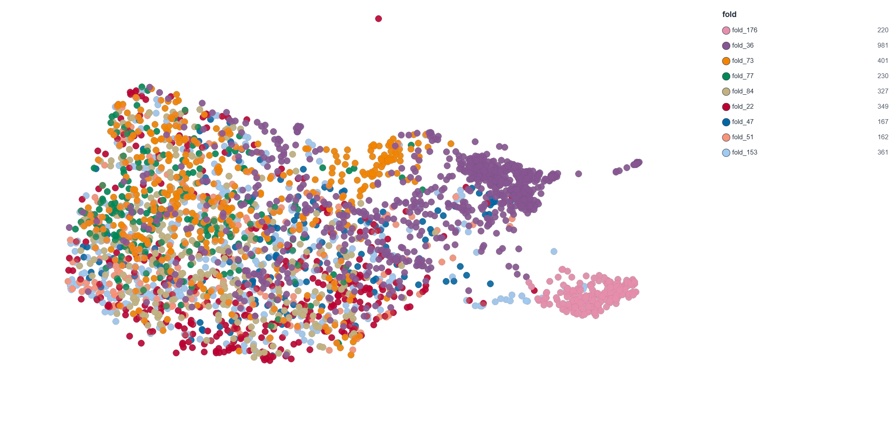

# Protein Transformer

A small protein language model trained from scratch, with attention pattern
analysis to study how structural information emerges across model scale and
training dynamics.

**Status:** 
5M and 20M models trained. Both recover SCOP fold structure from sequence alone, well above chance. Attention heads scored against a 90-protein contact evaluation set: neither model shows long-range contact recovery above chance, in contrast to ESM-2 on the identical pipeline. Currently investigating whether this reflects model scale, training data volume, or both.
---

## What this project is

This project trains an encoder-only transformer on protein sequences using
masked language modeling (MLM), then analyzes what the model learned by
examining its attention patterns. The central research question: *at what
scale and at what point in training does structural information emerge in
attention heads?*

---

## Results so far

Both models were trained on ~80K homology-split SwissProt proteins via MLM,
with no structural labels of any kind.
 
| | 5M | 20M |
|---|---|---|
| Layers / heads / d_model | 6 / 8 / 256 | 8 / 8 / 448 |
| Parameters | 4.87M | 19.5M |
| Validation perplexity | 14.36 | 14.18 |
| Fold k-NN hit rate | 0.630 | 0.688 |
| Fold k-NN lift over baseline | 0.493 | 0.551 |
 
Baselines: uniform over 20 amino acids gives perplexity ~20; the k-NN
hypergeometric baseline is 0.137 at `min_fold_size=10`.
 
Two things are worth noting in that table. Both models cluster proteins by
SCOP fold far above chance despite never seeing a structural label, which is
the sanity check that the models learned something protein-like rather than
surface statistics. And the 4x parameter increase bought a 1.2% perplexity
improvement but a 12% improvement in k-NN lift: at this scale the extra
capacity went into representation quality rather than into token prediction
accuracy. MLM loss is a poor proxy for how much structural information the
model has organized.
The k-NN evaluation uses the
TAPE remote homology dataset (1,195 SCOP folds) as an external probe.



A UMAP projection of the embeddings (illustration only — the k-NN number is the
quantitative evidence) shows one fold group cleanly isolating while most folds
overlap, consistent with the model's scale.

### Known confound between the two runs
 
The 20M run used a learning rate of 2.0e-4 and batch size 32; the 5M run used
3.0e-4 and batch size 64. The reduction follows common practice for larger
models at smaller batch sizes, but it means parameter count is not the only
variable separating the two runs. Any claim about the effect of scale is
really a claim about scale plus tuned learning rate.
 
Because batch sizes differ, cross-model comparisons use tokens seen or
normalized training progress on the x-axis, never raw step count. The retained
checkpoint sequences allow comparison at matched token budgets rather than only
at the endpoints, which is a partial control on this confound.
 
---

### Attention does not recover long-range contacts, unlike ESM-2
 
Every (layer, head) of the 20M model was scored against the 90-protein contact
evaluation set with `precision@L/5` (long-range pairs, |i−j| ≥ 24), symmetrized
and APC-corrected.
 
| | 20M (this model) | ESM-2 (`esm2_t6_8M_UR50D`) |
|---|---|---|
| Mean precision across all heads | 0.0197 | 0.0367 |
| Mean random baseline | 0.0184 | 0.0184 |
| Best single head, lift | 0.0087 | 0.1597 |
| Best head, Wilcoxon p (paired, n=90) | 0.052 (uncorrected) | < 0.0001 |
 
The 20M model's best head does not clear significance even before correcting
for having tested 64 heads (Bonferroni would require p < 0.05/64 ≈ 0.0008).
Mean lift across all heads is 0.0012 — indistinguishable from zero.
 
ESM-2, run through the identical eval set, geometry, and scoring code,
shows a clear and highly significant signal, concentrated in layer 5
(6 of the top 10 heads), consistent with the mid-network localization of
structure-sensitive heads reported in Vig et al. (2021). This was run
specifically as a positive control: a null result on an unvalidated pipeline
is uninformative, and this result rules out a scoring or geometry bug as the
explanation for the 20M model's null.
 
**Reading of the result.** The in-house model recovers fold-level information
(the k-NN result above) but not pairwise long-range contact structure in
attention, at 20M parameters trained on ~80K sequences. This dissociation —
fold identity present, pairwise contacts absent — is itself a finding, and it
bears directly on the scaling question this project asks. It is not yet
possible to say whether the limiting factor is parameter count or training
data volume: ESM-2 was pretrained on UniRef50 at a much larger scale on both
axes simultaneously, so this comparison confounds the two. Disentangling them
(more training data at fixed model size, or the 1M model as a smaller data
point on the same recipe) is the next step.
 
---
 
## Contact evaluation set
 
Built from the TAPE/ProteinNet validation split. The filter chain, with counts:
 
| Stage | Remaining |
|---|---|
| ProteinNet validation split | 224 |
| Length 80–300 and coverage ≥ 90% | 98 |
| `n_contacts >= k` where `k = L // 5` | 90 |
 
Median per-protein random baseline across the kept set is **0.015** — the
fraction of eligible pairs that are true long-range contacts. This is the
number any per-head precision must be read against.
 
**Why the validation split rather than test.** The test split holds only 40
records, too few to survive contamination filtering against the training
sequences. No training happens on any of this data — the model is frozen and
its attention probed — so TAPE's train/valid/test boundary, which exists to
protect supervised contact predictors from leakage, does not apply here. The
leakage that does matter is between these sequences and the 100K SwissProt
training set, which is handled separately by MMseqs2.
 
**Why `n_contacts >= k`.** Precision@k always selects exactly `k` pairs, so a
protein with fewer than `k` true contacts has a ceiling of `n_contacts / k`
rather than 1.0. Averaging across proteins with different ceilings makes the
mean uninterpretable. The 8 proteins removed by this filter were all short
(L 88–108), which is the same small-L effect that motivated the length floor.
 
**Contact convention.** 
ProteinNet supplies Cα coordinates only, so contacts
are Cα–Cα within 8 Å. The contact-prediction literature (CASP, ESM) uses
Cβ–Cβ with Cα substituted for glycine. The two agree on most pairs but differ
near the threshold, where side-chain orientation matters, so absolute precision
figures here are not directly comparable to published Cβ-based numbers.
---

## Project structure

```
protein-transformer/
├── configs/
│   ├── 1M.yaml
│   ├── 5M.yaml
│   └── 20M.yaml
├── src/plm/
│   ├── config.py
│   ├── data/
│   │   ├── tokenizer.py
│   │   ├── fasta.py
│   │   ├── dataset.py
│   │   └── collator.py
│   ├── model/
│   │   ├── embeddings.py
│   │   ├── attention.py
│   │   ├── transformer.py
│   │   └── mlm.py
│   ├── training/
│   │   ├── trainer.py
│   │   └── checkpoint.py
│   ├── eval/
│   │   ├── perplexity.py
│   │   ├── knn_probe.py        # fold k-NN probe + hypergeometric baseline
│   │   └── tape_data.py        # TAPE LMDB loader
│   └── analysis/
│       ├── contacts.py         # contact maps + eligibility masks
│       ├── extract.py          # per-head attention matrices (in-house + ESM-2)
│       ├── contact_score.py    # symmetrize, APC, precision@L/5
│       └── load.py             # rebuild a trained model from a Hub checkpoint
├── scripts/
│   ├── build_filtered_fasta.py
│   ├── build_splits.py
│   ├── build_eval_set.py       # contact eval set from ProteinNet
│   ├── train.py
│   ├── evaluate.py
│   ├── run_head_scoring.py     # score all (layer, head) against the eval set
│   ├── esm2_comparison.py      # positive-control run against ESM-2
│   └── export_for_protspace.py # embeddings + labels for ProtSpace viz
└── tests/
    ├── test_tokenizer.py
    ├── test_collator.py
    ├── test_dataset.py
    ├── test_model_shapes.py
    ├── test_checkpoint_resume.py
    ├── test_contacts.py
    └── test_contact_score.py
```


---

## Quickstart

### 1. Clone and install

```bash
git clone https://github.com/dariasof/protein-transformer.git
cd protein-transformer
python -m venv .venv
source .venv/Scripts/activate   # Windows Git Bash
# source .venv/bin/activate     # macOS / Linux
python -m pip install --upgrade pip
python -m pip install -e ".[dev]"
```

### 2. Build homology-aware splits

**Step 1 — local.** Filter SwissProt to 100K clean sequences and write
`data/processed/filtered.fasta`:

```bash
python scripts/build_filtered_fasta.py --config configs/5M.yaml
```

**Step 2 — Kaggle (requires MMseqs2).** Cluster at 30% identity, assign
whole clusters to splits, tokenize, and save:

```bash
# install MMseqs2 on Kaggle
!apt-get install -y mmseqs2

python scripts/build_splits.py --config configs/5M.yaml
```

Produces `data/processed/train.pt` (80,435), `val.pt` (9,613),
`test.pt` (9,952).

### 3. Train

```bash
python scripts/train.py --config configs/5M.yaml
```

### 4. Evaluate

Perplexity only:

```bash
python scripts/evaluate.py \
    --config configs/5M.yaml \
    --checkpoint data/checkpoints/resume.pt
```

Perplexity plus fold k-NN probe (requires the TAPE remote homology LMDB):

```bash
python scripts/evaluate.py \
    --config configs/5M.yaml \
    --checkpoint data/checkpoints/resume.pt \
    --tape-path data/remote_homology/remote_homology_train.lmdb
```

### 5. Build the contact evaluation set
 
Requires the TAPE ProteinNet LMDB under `data/raw/proteinnet/`.
 
```bash
python scripts/build_eval_set.py
```
 
Writes `data/processed/eval_manifest.csv` (all 224 candidates, with each
filter decision recorded) and `data/processed/eval_seqs.fasta` (the survivors,
for MMseqs2 contamination filtering).

### 6. Score attention heads against the contact evaluation set
 
```bash
python scripts/run_head_scoring.py \
    --config configs/20M.yaml \
    --repo-id dariasof/protein-transformer-20M \
    --checkpoint ckpt_step_025140.pt \
    --min-separation 24 \
    --use-apc
```
 
Writes `data/processed/head_scores_<checkpoint-stem>.npz` containing
per-protein, per-head precision plus the per-protein random baseline.
 
To validate the pipeline against a reference model:
 
```bash
python scripts/esm2_comparison.py --model facebook/esm2_t6_8M_UR50D --use-apc
```

---

## Trained models

Checkpoints are on the HuggingFace Hub:
 
- [`dariasof/protein-transformer-5M`](https://huggingface.co/dariasof/protein-transformer-5M) — steps 500–17560
- [`dariasof/protein-transformer-20M`](https://huggingface.co/dariasof/protein-transformer-20M) — through step 24000

The full checkpoint sequence is retained for training-dynamics
study.

---

## Design decisions

**Tokenization.** Character-level, one token per amino acid. Vocabulary of 24
tokens: 20 standard amino acids + `[PAD]`, `[UNK]`, `[CLS]`, `[MASK]`.
`[PAD]` is id 0 so PyTorch's default padding behavior works without
configuration.

**MLM objective.** 15% of amino acid positions selected per sequence.
Of those, 80% replaced with `[MASK]`, 10% replaced with a random amino acid,
10% left unchanged. The 80/10/10 split prevents the model from only building
good representations at `[MASK]` positions — it must represent all tokens
well, which is what makes the embeddings useful for downstream tasks.

**Homology-aware splits.** Sequences clustered with MMseqs2 at 30% identity.
Whole clusters assigned to train/val/test — no sequence has a close homolog
in a different split. This is the methodological detail that makes held-out
evaluation meaningful.

**Data filtering.** Sequences between 30 and 511 residues, standard amino
acids only (no B/J/O/U/X/Z). Keeps sequences clean for the 24-token vocab
and avoids polluting training with ambiguous residues.

**Architecture.** Encoder-only transformer, pre-norm convention (LayerNorm
before each sub-layer, not after). Bidirectional attention — no causal mask —
because MLM prediction benefits from full sequence context in both directions.
The 1M baseline is 4 layers / 4 heads / d_model 128; the 5M model is
6 layers / 8 heads / d_model 256.

**Embedding extraction.** Mean pooling over residue hidden states (taken after
the final LayerNorm, before the MLM head), not the `[CLS]` token. The model
has no CLS-specific training objective, so mean pooling is the principled
choice for sequence-level embeddings.

**Fold k-NN probe.** Embeddings are scored by whether a protein's nearest
neighbors share its SCOP fold. The metric is hit rate (≥1 of the top-10
neighbors shares the fold), reported against a per-query hypergeometric
baseline; lift is hit rate minus baseline. Queries whose fold has too few
members to be findable are filtered via `min_fold_size`.

**Mixed precision.** fp16 via `torch.autocast` + `GradScaler`. Gradients
unscaled before clipping to preserve the `max_grad_norm` threshold.
bf16 unsupported on Kaggle P100/T4 — fp16 only.

**Checkpointing.** Two checkpoint types: a rolling `resume.pt` saved every
500 steps (overwrites each time), and permanent named checkpoints every
`retain_every` steps (`ckpt_step_XXXXXX.pt`). The named checkpoints are the
raw material for the training-dynamics emergence study — they
cannot be retrofitted later. Checkpoints are mirrored to the HuggingFace Hub.

**Attention extraction.** Sequences are run one at a time with `return_attentions=True`,
and the `[CLS]` row and column are stripped so the resulting `[n_layers,
n_heads, L, L]` tensor aligns positionally with the contact map. Two
assertions guard the alignment: attention rows must sum to 1 before stripping
(catching a forgotten `eval()`, a pre-softmax tensor, or a transposition), and
the stripped shape must equal the sequence length. MLM masking is not applied —
mask tokens distort attention patterns.
 
**Unresolved residues.** ProteinNet stores residues without coordinates as
`[0, 0, 0]`. The origin is a real point in space, so a residue near it would
otherwise register as being in contact with every unresolved residue. Both
endpoints of a pair must be masked, not just one. Covered by a regression test.

---

## Roadmap

|  | Focus | Status |
|------|-------|--------|
| 1 | Data pipeline: tokenizer, dataset, MLM collator | ✅ Done |
| 2 | Transformer architecture + training loop | ✅ Done |
| 3 | Config system, 100K proteins, homology-aware splits, eval script | ✅ Done |
| 4 | Train 5M model, fold k-NN embedding check | ✅ Done |
| 5 | Train 20M model | ✅ Done |
| 6–8 | Attention analysis pipeline, head atlas | — |
| 9–11 | Scaling study, training dynamics, ESM-2 comparison | — |
| 12–14 | Polish, writeup, HuggingFace model cards | — |

---

## License

MIT — see [LICENSE](LICENSE).